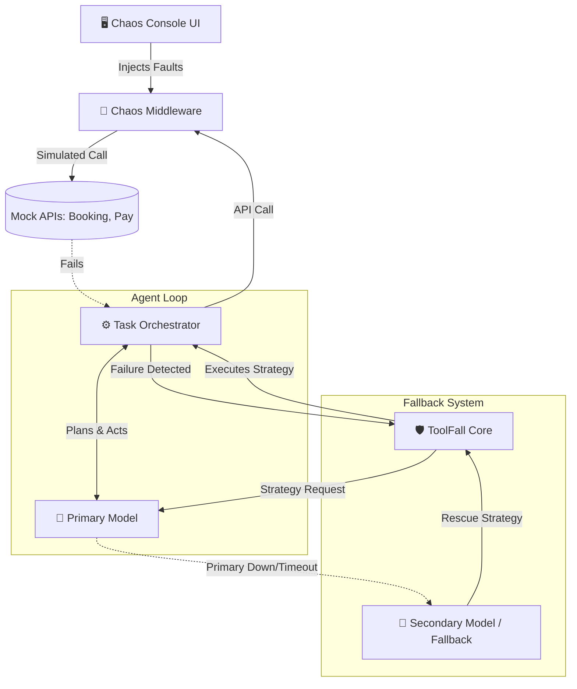

<div align="center">
  
  
  # ToolFall
  
  **The ultimate resilience layer for AI agents.**  
  *Most "AI agent" demos assume every tool call succeeds — ours assumes the opposite.*

  [](https://vocallabs-ai-hackathon-frontend.vercel.app/)
  [](https://toolfall-backend-production.up.railway.app/)
  [](#evaluation-harness)
  [](https://github.com/PrasoonKumar27/Vocallabs-AI-Hackathon)

</div>

<br />

> **🏆 Hackathon Goal:** To build an AI agent that **never crashes**, handles API failures gracefully, visually demonstrates fallback mechanisms, and relies on a dual-model architecture. **ToolFall delivers exactly this.**

---

## 🚀 Project Links & Live Demo

*   **GitHub Repository:** [https://github.com/PrasoonKumar27/Vocallabs-AI-Hackathon](https://github.com/PrasoonKumar27/Vocallabs-AI-Hackathon)
*   **Frontend (Interactive 3D Chaos Console):** [https://vocallabs-ai-hackathon-frontend.vercel.app/](https://vocallabs-ai-hackathon-frontend.vercel.app/)
*   **Backend (FastAPI Engine):** [https://toolfall-backend-production.up.railway.app/](https://toolfall-backend-production.up.railway.app/)

*Tip: Open the Frontend link, click "Start Task", and use the Chaos Console to inject latency spikes, server crashes, and corrupt payloads in real-time. Watch the agent dynamically recover!*

---

## ✨ Key Features

*   **🎮 Live Chaos Console:** Inject real-world failures mid-execution (500 Server Errors, Latency Spikes, Corrupt Payloads, Rate Limits, Silent Nulls).
*   **🧠 Model-Driven Resilience:** A primary AI model evaluates failures and dynamically chooses strategies (Retry, Backoff, Serve Cached, Escalate).
*   **🔄 Dual-Model Circuit Breaker:** If the primary model fails or becomes unavailable, the system seamlessly transitions to a secondary rule-based fallback model to keep the application running.
*   **📊 Cinematic 3D UI:** A beautifully crafted, glassmorphism-inspired 3D interface built for recruiters and judges to instantly understand system state.
*   **🛡️ Evaluation Harness:** A rigorous testing suite that runs 22 distinct chaos scenarios, achieving a 100% (22/22) pass rate.

---

## 🏗️ Architecture



---

## ✅ Hackathon Constraints Satisfied

*   [x] **No Crash Allowed:** A robust state-machine ensures failures trigger structured fallback strategies or controlled escalations without killing the execution loop.
*   [x] **Visible Fallback:** The frontend live-traces the strategy chosen by the model with specific UI callouts, 3D animated banners, and narrative logs when failovers occur.
*   [x] **Two Different Models:** Gemini serves as the primary task planner and strategist. A strict rule-based fallback model acts as the secondary, ensuring the agent remains functional even during total provider outages.
*   [x] **Simulated Real-World Constraints:** The backend mocks 4 distinct APIs, each with native latencies, supporting 6 distinct failure types triggered instantly via the Chaos Console.

---

## 💡 The Five Questions

1. **What problem, and who exactly has it?**
   An engineer shipping an AI agent into production — for example, at a company whose voice/chat agents depend on real-time calls to booking, payment, and CRM systems — who has watched an agent silently break or report false success when a downstream API returns garbage.
2. **What is the non-obvious hard part?**
   Telling apart a fault that's safe to retry from one that must escalate — a payment call failing silently is not the same risk as a notification call failing — and making that call with a model rather than a static rule table, without the model itself becoming a new point of failure.
3. **What did you build versus what did the API give you?**
   The API gives a single tool call and a single response. We built the supervising layer around it: fault classification, a bounded state machine, a model-driven strategy selector, a second model as a live failover path, and an evaluation harness that scores resilience numerically across 20+ scenarios.
4. **Why does this break if you remove the AI?**
   Without a model in the loop, fault handling collapses to a fixed if/else that can't weigh "this is the 2nd payment failure, escalate" against "this is the 1st notification failure, retry" using task context — only the error code.
5. **What breaks at ten thousand users?**
   The in-memory state and single-process WebSocket fan-out don't horizontally scale (would need Redis for shared state); a model call on every single fault adds real latency/cost at volume, which is exactly why the hard-coded payment-escalation safety net exists as a cost/latency circuit-breaker rather than relying on a model call for every failure.

---

## 💻 Local Quickstart

Want to run it locally? ToolFall requires Python 3.10+ and Node.js.

### 1. Start the Backend (FastAPI)
```bash
cd backend
pip install -r requirements.txt
python -m uvicorn main:app --host 0.0.0.0 --port 8000
```

### 2. Start the Frontend (Next.js)
```bash
cd frontend
npm install
npm run dev
```
Open **[http://localhost:3000](http://localhost:3000)** in your browser.

---

## 📚 Further Reading

*   **[FAILURE_LOG.md](FAILURE_LOG.md):** Read our honest log about what worked, what didn't, and our strict eval metrics.
*   **[DEMO_SCRIPT.md](DEMO_SCRIPT.md):** The step-by-step guide on how to present this project.

---
*Built with ❤️ for the Vocallabs AI Hackathon.*
